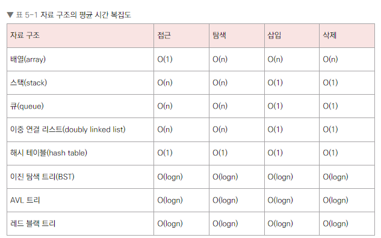
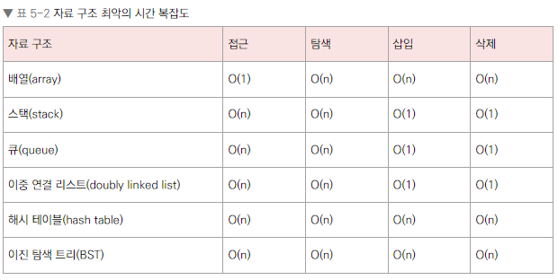
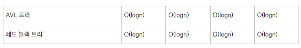

# 1. 복잡도

- 자료 구조: 효율적으로 데이터를 관리하고 수정, 삭제, 탐색, 저장할 수 있는 데이터 집합

## C++ 기본문법
```c++
#include <bits/stdc++.h> // --- (1)
using namespace std;     // --- (2)
string a;                // --- (3)
int main()
{
    cin >> a;            // --- (4)
    cout << a << "\n";   // --- (5)
    return 0;            // --- (6)
} 
```
1) 헤더 파일, STL 라이브러리 임포트
2) std라는 네임스페이스 사용
3) 문자열 선언
4) 입력 ex) cin, scaf
5) 출력 ex) cout, printf
6) return 0 -> 프로세스 정상 마무리

- 온라인 컴파일러 : https://www.onlinegdb.com/online_c++_compiler

## 1. 시간 복잡도
### 빅오 표기법
- 시간 복잡도 : 입력 크기에 대해 어떠한 알고리즘이 실행되는 데 걸리는 시간
  - 주요 로직의 반복 횟수를 중점으로 측정
  - 가장 영향을 많이 끼치는 항의 상수 인자를 빼고 나머지 항을 없앰
  - 증가 속도를 고려하면, 주요항 제외 다른 항은 영향이 미미함
### 존재 이유
- 효율적인 코드로 개선하는 데 쓰이는 척도

## 2. 공간 복잡도
- 프로그램을 실행시켰을 때 필요로 하는 자원 공간의 양
  - 정적 변수로 선언된 것 + 동적으로 재귀적인 함수로 인해 공간을 계속해서 필요로 할 경우도 포함
  ```c++
  int a[1004];
  ```
  -> a배열은 1004x4바이트의 크기를 가짐 
## 3. 자료 구조에서의 시간 복잡도


